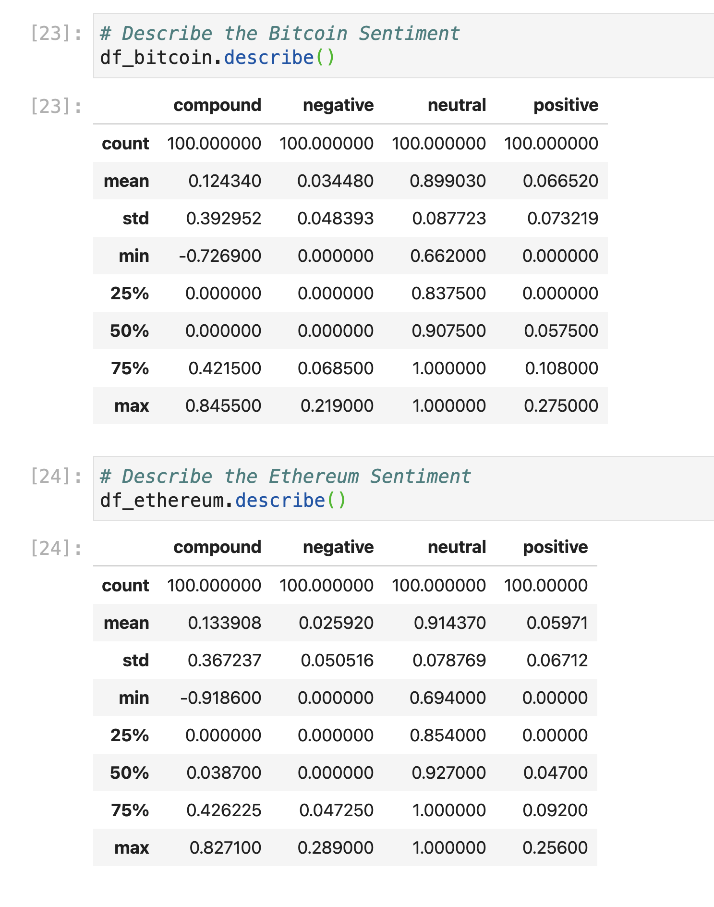
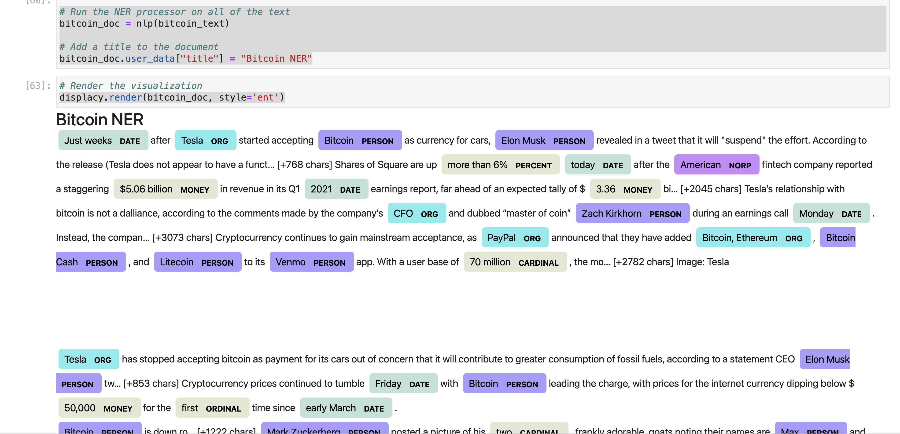
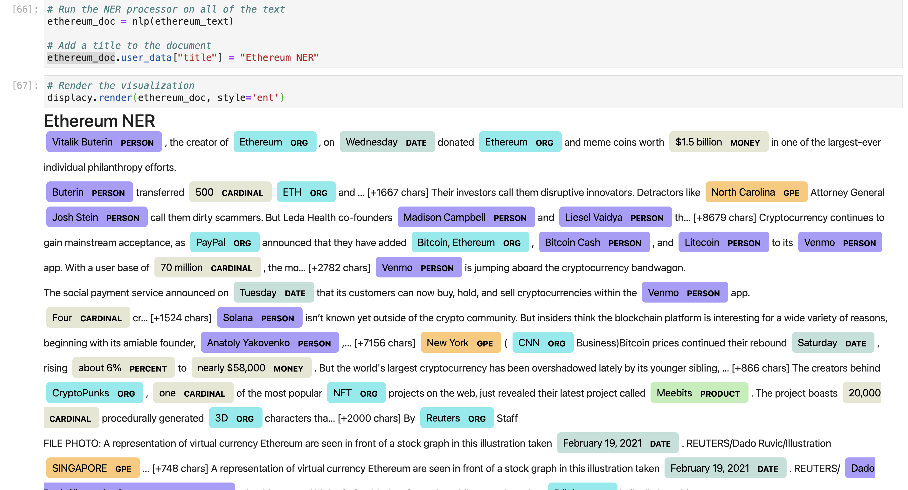

# Sentiments Analysis of Crypto Currencies using NLP

First part of the assignment is finding the sentiments for both Bitcoin and Ethereum in news articles.

First the articles are pulled using News API

Then SentimentIntensityAnalyzer is used and by using "describe" function, the analysis is displayed like below

Second part of assignment is using NLP and Tokenizer and also displaying the data using WordCloud and displayed as below

## Bitcoin WordCloud

## Ethereum WordCloud

NER representation using NLP

Using the spaCy library and NER Processer Bitcoin NER is represented as below

Using the spaCy library and NER Processer Ethereum NER is represented as below

